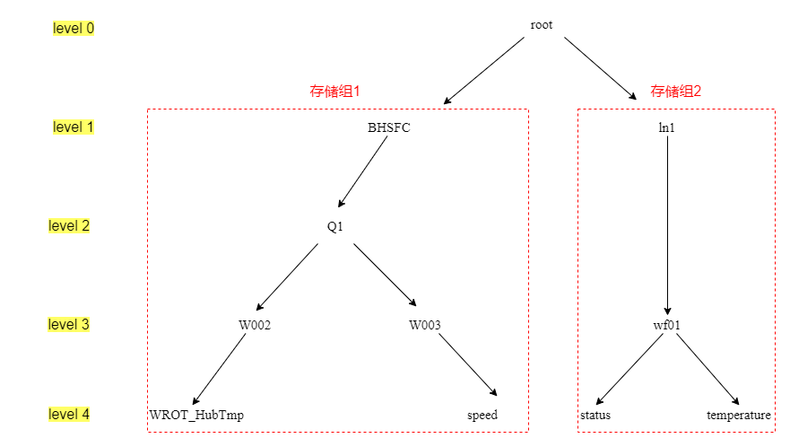

# TsFile管理

我们利用已有的TsFile文件来体验其操作，首先我们进入IoTDB的data文件夹，一路点进去能找到TsFile后缀的文件，和以TsFlie.resource为后缀的文件，我们只复制那一个TsFile后缀的文件到其他文件夹即可，然后进行删除操作，最后再加载复制过去的TsFile。

## 删除TsFile

我们可以使用`remove '<path>' `语句来删除TsFile文件，例如我们删除/usr/apache-iotdb-0.13.0-all-bin/data/data/sequence/root.BHSFC/0/0/文件夹下的1657277482259-1-0-2.tsfile文件，指令为：

```SQL
remove '/usr/apache-iotdb-0.13.0-all-bin/data/data/sequence/root.BHSFC/0/0/1657277482259-1-0-2.tsfile'
```

提示executed successfully，我们可以查询一下行数，发现变为0了：

```SQL
IoTDB> select count(WROT_HubTmp) from root.BHSFC.Q1.W002
+-------------------------------------+
|count(root.BHSFC.Q1.W002.WROT_HubTmp)|
+-------------------------------------+
|                                    0|
+-------------------------------------+
Total line number = 1
```

## 加载TsFile

加载TsFile文件的指令为：`load '<path/dir>' [autoregister=true/false][,sglevel=int][,verify=true/false]`

这里的路径可以是文件路径也可以是文件夹路径，可以导入单个文件或者导入文件夹。autoregister表示是否自动创建 schema ，参数为 true 表示自动创建 schema，相反 false 表示不创建，默认为true；sglevel表示设定存储组级别，默认为iotdb-datanode.properties中设置的级别；verify表示是否对TsFile中的时间序列进行元数据检查，默认为 true。开启时如果载入的 tsfile 中的时间序列在当前 iotdb 中也存在，则会比较该时间序列的所有 Measurement 的数据类型是否一致，如果出现不一致将会导致载入失败，关闭该选项会跳过检查，载入更快。

我们输入如下，此前已将TsFile文件复制到了文件夹/var/opt/下：

```SQL
load '/var/opt/1657277482259-1-0-2.tsfile' autoregister=false,sglevel=1,verify=true
```

输入之后显示executed successfully，可以查询一下行数来验证是否已经导入成功，发现行数由0变为13834了：

```SQL
IoTDB> load '/var/opt/1657277482259-1-0-2.tsfile' autoregister=false,sglevel=1,verify=true
Msg: The statement is executed successfully.
IoTDB> select count(WROT_HubTmp) from root.BHSFC.Q1.W002
+-------------------------------------+
|count(root.BHSFC.Q1.W002.WROT_HubTmp)|
+-------------------------------------+
|                                13834|
+-------------------------------------+
Total line number = 1
```

# 存储组管理

## 创建存储组

根据存储模型创建数据模型，我们可以使用CREATE STORAGE GROUP语句，例如创建一个名为root.ln的存储组：

```SQL
create storage group root.ln
```

提示“The statement is executed successfully”：

```SQL
IoTDB> create storage group root.ln
Msg: The statement is executed successfully.
```

## 查看存储组

我们可以使用show storage group语句查看存储组，SQL语句如下：

```SQL
show storage group
```

使用show storage group查看所有存储组，输出的结果如下：

```SQL
IoTDB> show storage group
+-------------+
|storage group|
+-------------+
|   root.BHSFC|
+-------------+
Total line number = 1
```

同样也可以使用通配符*简化查询，如show storage group root.*。

## 删除存储组

我们可以使用delete storage group<pathpattern>语句删除存储组，删除存储组roo.BHSFC的SQL语句为：

```SQL
delete storage group root.BHSFC
```

同样我们可以使用通配符*简化语句。

## 统计存储组数量

我们可以使用count storage group<pathpattern>语句统计存储组数量，统计所有存储组的SQL语句为：

```SQL
count storage group
```

输入结果为：

```SQL
IoTDB> count storage group
+-------------+
|storage group|
+-------------+
|            1|
+-------------+
Total line number = 1
```

同样我们可以使用通配符*简化语句。

# 时间序列管理

## 创建对齐时间序列

前面我们创建了单条时间序列root.BHSFC.Q1.W003.speed。现在我们来创建对齐时间序列。对齐指的是不同传感器的值同时到来，即时间序列可以按一列时间戳来存储，例如我们看之前的数据模式图，设备w002和w003分属两个实体，它们之下的两条时间序列是非对齐的，即存储的时间戳和时间间隔可以不一致。而设备wf01下有两个传感器，status和temperature可以设置为对齐时间序列。



我们可以输入SQL语句：

```SQL
create aligned timeseries root.ln.wf01(status BOOLEAN encoding=PLAIN compressor=SNAPPY, temperature FLOAT encoding=PLAIN compressor=SNAPPY)
```

## 查询时间序列

我们可以使用show timeseries <`Path`>来查询时间序列。例如查询所有时间序列的SQL语句：

```SQL
show timeseries
```

输出结果为：

```SQL
IoTDB> show timeseries
+------------------------------+-----+-------------+--------+--------+-----------+----+----------+
|                    timeseries|alias|storage group|dataType|encoding|compression|tags|attributes|
+------------------------------+-----+-------------+--------+--------+-----------+----+----------+
|      root.ln.wf01.temperature| null|      root.ln|   FLOAT|   PLAIN|     SNAPPY|null|      null|
|           root.ln.wf01.status| null|      root.ln| BOOLEAN|   PLAIN|     SNAPPY|null|      null|
|root.BHSFC.Q1.W002.WROT_HubTmp| null|   root.BHSFC|  DOUBLE| GORILLA|     SNAPPY|null|      null|
|      root.BHSFC.Q1.W003.speed| null|   root.BHSFC|   FLOAT|     RLE|     SNAPPY|null|      null|
+------------------------------+-----+-------------+--------+--------+-----------+----+----------+
Total line number = 4
```

查询存储组root.BHSFC下的时间序列：

```SQL
show timeseries root.BHSFC.**
```

输出结果为：

```SQL
IoTDB> show timeseries root.BHSFC.**
+------------------------------+-----+-------------+--------+--------+----------                                               -+----+----------+
|                    timeseries|alias|storage group|dataType|encoding|compressio                                               n|tags|attributes|
+------------------------------+-----+-------------+--------+--------+----------                                               -+----+----------+
|root.BHSFC.Q1.W002.WROT_HubTmp| null|   root.BHSFC|  DOUBLE| GORILLA|     SNAPP                                               Y|null|      null|
|      root.BHSFC.Q1.W003.speed| null|   root.BHSFC|   FLOAT|     RLE|     SNAPP                                               Y|null|      null|
+------------------------------+-----+-------------+--------+--------+----------                                               -+----+----------+
Total line number = 2
```

## 删除时间序列

我们可以使用`DELETE TimeSeries <PathPattern>`语句来删除时间序列,例如删除时间序列root.ln.wf01.temperature的SQL 语句如下：

```Plain
delete timeseries root.ln.wf01.temperature
```

### 统计时间序列总数

我们可以使用`COUNT TIMESERIES<Path>`来统计一条路径中的时间序列个数。例如统计所有的时间序列，SQL 语句为：

```SQL
count timeseries root.**
```

显示结果为：

```SQL
IoTDB> count timeseries root.**
+-----+
|count|
+-----+
|    3|
+-----+
Total line number = 1
```

# 元数据模板管理

元数据模板可以简化同类型实体的管理，减少元数据内存占用。

## 创建元数据模板

根据需要可以创建不同的元数据模板，例如我有两个对齐的时间序列，那么可创建包含一组对齐序列的元数据模板，SQL语句为：

```SQL
create schema template t1 aligned (1 FLOAT encoding=Gorilla, 2 FLOAT encoding=Gorilla)
```

## 挂载元数据模板

创建之后挂载元数据模板，这里我们选择把它应用到root.ln存储组的下一层级，SQL语句为：

```SQL
set schema template t1 to root.ln.wf01
```

此时这个模板是空的，虽然这个存储组下有两条之前创建的时间序列，但它们不会挂载到新创建的元数据模板。我们重新创建时间序列，SQL语句为：

```SQL
create timeseries of schema template on root.ln.wf01.test
```

这样两条共享root.ln.wf01.test路径的时间序列就创建好了，我们简单查询一下时间序列：

```SQL
show timeseries root.ln.**
```

查询结果显示：

```SQL
IoTDB> show timeseries root.ln.**
+------------------------+-----+-------------+--------+--------+-----------+----+----------+
|              timeseries|alias|storage group|dataType|encoding|compression|tags|attributes|
+------------------------+-----+-------------+--------+--------+-----------+----+----------+
|     root.ln.wf01.test.1| null|      root.ln|   FLOAT| GORILLA|     SNAPPY|null|      null|
|     root.ln.wf01.test.2| null|      root.ln|   FLOAT| GORILLA|     SNAPPY|null|      null|
|root.ln.wf01.temperature| null|      root.ln|   FLOAT| GORILLA|     SNAPPY|null|      null|
|     root.ln.wf01.status| null|      root.ln|   FLOAT| GORILLA|     SNAPPY|null|      null|
+------------------------+-----+-------------+--------+--------+-----------+----+----------+
Total line number = 4
```

可以看到两条时间序列root.ln.wf01.test.1和root.ln.wf01.test.2已经创建好了。

我们检查一下是否对齐：

```SQL
show devices root.ln.wf01.**
```

查询结果为：

```SQL
IoTDB> show devices root.ln.wf01.**
+-----------------+---------+
|          devices|isAligned|
+-----------------+---------+
|root.ln.wf01.test|     true|
+-----------------+---------+
Total line number = 1
```

## 查看元数据模板

查看所有元数据模板，SQL 语句为：

```SQL
show schema templates
```

查询结果为：

```SQL
IoTDB> show schema templates
+-------------+
|template name|
+-------------+
|           t1|
+-------------+
Total line number = 1
```

查看某个元数据模板下的物理量，SQL语句为：

```SQL
show nodes in schema template t1
```

查询结果为：

```SQL
IoTDB> show nodes in schema template t1
+-----------+--------+--------+-----------+
|child nodes|dataType|encoding|compression|
+-----------+--------+--------+-----------+
|          1|   FLOAT| GORILLA|     SNAPPY|
|          2|   FLOAT| GORILLA|     SNAPPY|
+-----------+--------+--------+-----------+
```

## 卸载/删除元数据模板

卸载元数据模板，SQL语句为：

```SQL
unset schema template t1 from root.ln.wf01
```

输入，会报错，说模板正在应用：

```SQL
IoTDB> unset schema template t1 from root.ln.wf01
Msg: 326: Template is in use on root.ln.wf01.test
```

因此我们需要先解除元数据模板的应用，SQL语句为：

```SQL
deactivate schema template t1 from root.ln.wf01.test
```

这时候再卸载就成功了。

最后我们删除这个元数据模板，SQL语句为：

```SQL
drop schema template t1
```

# 节点管理

## 查看子路径

我们可以使用`SHOW CHILD PATHS pathPattern`来查看此路径模式所匹配的所有路径的下一层的所有路径，例如查看root.BHSFC的下一层：

```SQL
show child paths root.BHSFC
```

输出为：

```SQL
IoTDB> show child paths root.BHSFC
+-------------+
|  child paths|
+-------------+
|root.BHSFC.Q1|
+-------------+
Total line number = 1
```

## 查看子节点

我们可以使用`SHOW CHILD NODES pathPattern`查看此路径模式所匹配的节点的下一层的所有节点，例如查询 root 的下一层：

```SQL
show child nodes root
```

输出为：

```SQL
IoTDB> show child nodes root
+-----------+
|child nodes|
+-----------+
|      BHSFC|
|         ln|
+-----------+
Total line number = 2
```

## 统计节点数

我们可以使用`COUNT NODES <PathPattern> LEVEL=<INTEGER>`来统计当前满足某路径模式的路径中指定层级的节点个数。


结合数据模式，假如我们想统计root.BHSFC存储组中这两个测点的设备数，SQL语句为：

```SQL
count nodes root.BHSFC.Q1.* level=3
```

输出结果为：

```SQL
IoTDB> count nodes root.BHSFC.Q1.* level=3
+-----+
|count|
+-----+
|    2|
+-----+
Total line number = 1
```

两个节点即level3上Q1的两个分支w002和w003。

下面这条SQL语句，则表示统计层级3，即路径ln之下所有的节点数：

```SQL
count nodes root.ln.** level=3
```

结合数据模式图可看到应为Wf01、status、temperature共3个。输出结果为：

```SQL
IoTDB> count nodes root.ln.** level=3
+-----+
|count|
+-----+
|    3|
+-----+
Total line number = 1
```