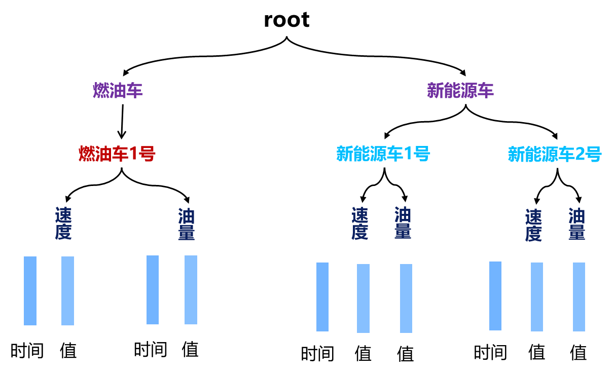
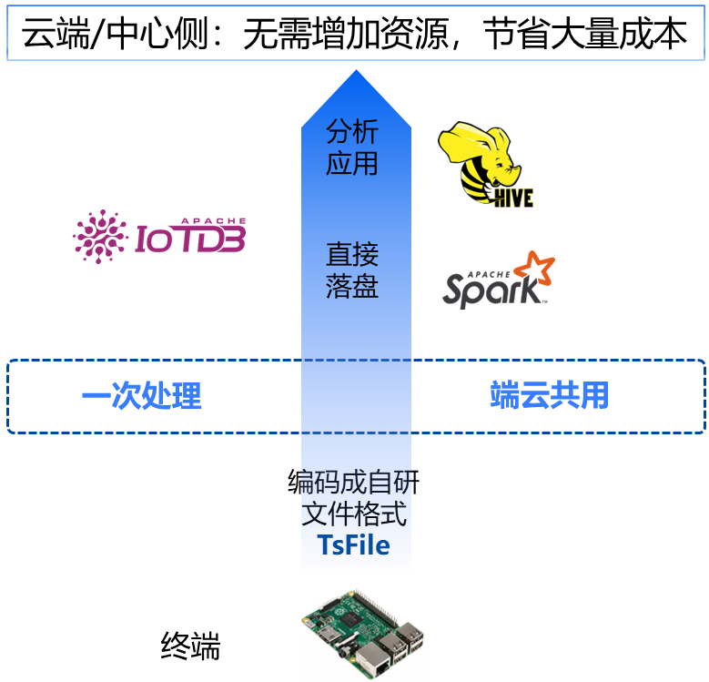

前面我们看到了IoTDB写入、查询性能瞩目，但这些足够一个时序数据库立身吗？其实初次除此之外，IoTDB的其他特性，相当有趣和惊喜。

# 为工业而生

为解决工业大数据问题诞生的IoTDB，天生就是为工业场景而设计。典型的工业场景，例如一个中等规模的工业企业，在数据采集环节可能会涉及10万~20万个传感器，每天产出的数据量超过百G。这些数据，既需要实时反应生产状况，又需要长期储存下来分析趋势。

海量测点，高频写入，因此需要极佳的写入性能。数据量大，查询性能也不能耗时过高。长期储存，没有强大的数据压缩会成本高昂。IoTDB支持千万点写入吞吐，TB数据毫秒级响应，无损压缩10倍起，有损压缩100倍以上，与同类数据库相比，在数据比较大的线上业务中每个月会差出来1到2块硬盘。

IoTDB不仅做到了低成本高性能，它的许多特性都让人惊喜。

# IoTDB特性

## 物联网数据专属模型

IoTDBD的数据模式是物联网原生模型，支持树状结构，如下图的车联网例子，单节点可管理百万设备、千万条时间序列，贴近物联网设备管理层级。可以自动化生成，减少运维和管理成本。

## “端-边-云”一站式解决方案  

IoTDB使用自研列式存储文件格式TsFile，一次处理，端云公用，一种文件格式贯穿“端-边-云”，避免重复计算和ETL开销。

## 丰富的数据生态 

IoTDB支持流式数据到达时计算、查询时计算和离线计算三大计算范式，自带触发器、用户自定义函数（UDF）、查询结果写回、连续查询等高级功能，让处理更方便。

同时在服务上百家大型企业中积攒了上百种工业协议，数据接入方便，并集成MQTT、与PLC4X、Pulsar、Flink、Spark、Grafana、Zeppelin等大数据系统无缝集成，覆盖时序数据的全生命周期，满足用户数据处理需求。

## 简单易用，便捷迁移

支持跨平台部署，只依赖 JDK/JRE，开箱即用，不依赖第三方系统和外部组件，降低运维成本；兼容多种 TSDB 接口，包括InfluxDB、Prometheus、KairosDB等，迁移简易。

# 结语

至此我们对时序数据库及IoTDB已有了初步的了解，接下来的教程将在实践中展示它的魅力。