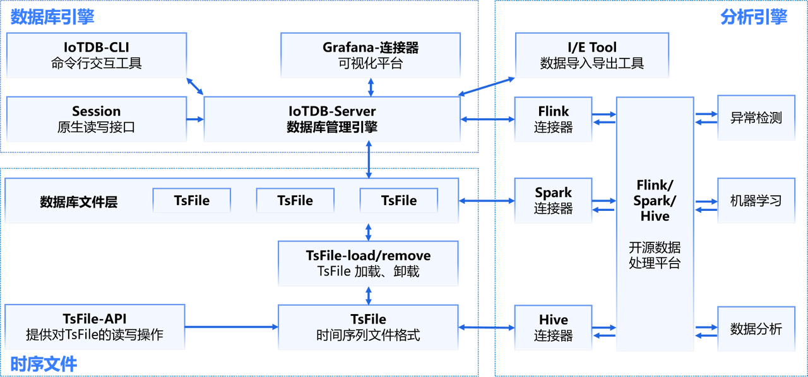
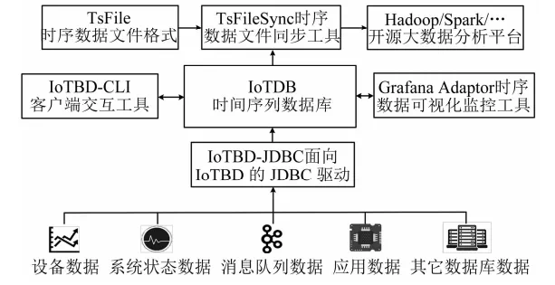
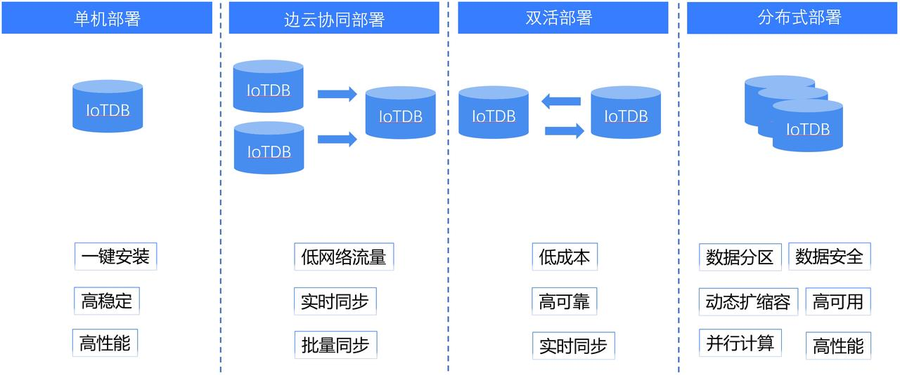

# IoTDB架构

IoTDB作为数据库管理系统，具有数据收集、数据写入、数据存储、数据查询、数据分析一系列功能,贯穿了数据的生命周期。

IoTDB的架构分为三个部分，时序文件、数据库引擎、分析引擎，IoTDB特指由时序文件和数据库引擎组成的时序数据库，分析引擎是可选的分析组件。

# TsFile介绍

TsFile是一种专门为时序数据设计的文件存储格式，支持高效的压缩和查询性能，能够为上层应用提供出色的数据存储和查询支持。TsFile既是IoTDB的核心组成部分，也可以独立使用，通过TsFileSync同步工具将文件同步至HDFS后即可在Hadoop或Spark等平台上进行数据处理。

后续文档将介绍如何通过Cli工具对TsFile文件进行管理。

# 部署形态

IoTDB的部署方式十分灵活。单机部署简单易用，一键安装，高稳定高性能。单机处理遇到瓶颈的时候就可以考虑集群版，例如边云协同部署和双活部署。边云协同部署能在低网络流量的情况下实现实时同步和批量同步，双活部署则能实现两台IoTDB之间数据实时同步，一个节点失效自动转换到另一个节点。分布式版则比集群版功能更上一个台阶，结构灵活，动态扩缩容，可靠性高，可用性好。

