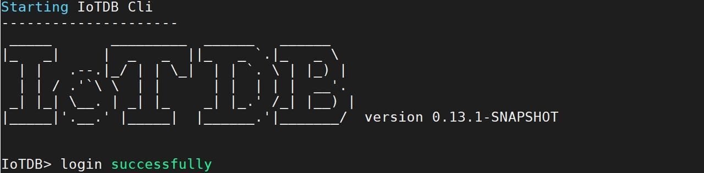

要使用IoTDB需要先启动IoTDB Server，再启动控制工具，控制工具有多种，这里我们先使用IoTDB自带的命令行工具Cli/Shell 工具，之后对数据的增删查改可以在Cli窗口中进行。

# 启动 IoTDB Server

## 默认参数启动

Linux及Mac系统下的启动指令（注意要进到解压后的IoTDB文件目录）：

```SQL
nohup sbin/start-server.sh >/dev/null 2>&1 &
```

可以简化为：

```sql
nohup sbin/start-server.sh &
```

Windows系统下的启动指令：

```Apache
sbin\start-server.bat &
```

如果显示`nohup: ignoring input and appending output to ‘nohup.out’，可以忽视，IoTDB是启动成功了的。

更推荐第一个指令，第二个指令会生成日志占用内存。

## 指定参数启动

上面这两条指令都会使用默认的参数登录，可以使用指定的参数，Linux和mac下的语句为`nohup sbin/start-server.sh -c <conf_path> -rpc_port <rpc_port> >/dev/null 2>&1 &`，Windows下的语句为：`sbin\start-server.bat -c <conf_path> -rpc_port <rpc_port>`。

其中"-c" 指定了配置文件所在的文件夹，"-rpc_port" 指定了启动的 rpc port。

例如我把安装包放在Windows系统下的D盘，端口为6667，那么我的启动指令为：

```html
sbin\start-server.bat -c D:\apache-iotdb-0.13.1-all-bin\conf -rpc_port 6667
```

Windows系统下，IoTDB Server启动成功会出现“IoTDB has started”字样，Linux系统下不会出现。


# 启动Cli工具

我们使用 sbin 文件夹下的 start-cli 脚本来启动Cli 工具。Linux和Mac系统下这样输入指令：

```Apache
sbin/start-cli.sh
```

Windows系统下要再开一个cli窗口（需进到文件夹“apache-iotdb-0.13.0-all-bin”下打开），输入指令为：

```Apache
sbin\start-cli.bat
```

默认参数为"-h 127.0.0.1 -p 6667 -u root -pw -root"，-p指定端口，-u指定用户，-pw指定用户密码，而默认端口是6667，默认用户是root，默认密码是root，这些参数可以修改，不修改的情况下可以这样输入：

```html
sbin/start-cli.sh -h 127.0.0.1 -p 6667 -u root -pw root
sbin\start-cli.bat -h 127.0.0.1 -p 6667 -u root -pw root
```

启动成功会提示“login successfully”，当前启动的是0.13.1版本。Linux系统下的启动界面如下：



# 退出Cli-工具

输入quit可退出 Cl结束会话：

```SQL
quit
```

# 退出IoTDB Server

可以使用$IOTDB_HOME/sbin 文件夹下的 stop-server 脚本停止 IoTDB。 

Linux和Mac系统的指令为： 

```Java
sbin/stop-server.sh
```

Windows系统的指令为： 

```Java
 sbin\stop-server.bat
```