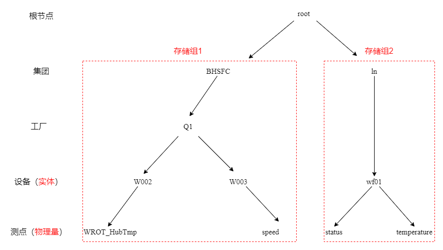

本文档将介绍数据的导入、查询、删除、导出所需的SQL语句，基于IoTDB的数据模式还将介绍元数据操作。

# 导入时间序列

我们可以手动或者自动写入数据，还可以连接终端接收数据。此处先介绍自动导入已有的数据表格的方法。

## 测试数据下载

我们给出一个测试用的数据表格，点击http://gofile.me/6WI2y/9TstJU5wt下载，这是一段时序数据，记载了某集团的2号高山风机在某段时间内的轮毂温度。  

## CSV导入

接下来利用IoTDB中tools文件夹下的CSV 工具，将 CSV 格式的数据导入 IoTDB中。

首先我们启动ioTDB server,然后去到tools目录，输入指令。Linux和Mac系统下的指令格式为：

```XML
import-csv.sh -h <ip> -p <port> -u <username> -pw <password> -f <xxx.csv> [-fd <./failedDirectory>] 
```

其中-f指定了要导入的数据，如果指定的是文件夹，就会把文件夹中所有的后缀为txt与csv的文件进行批量导入。-fd指定一个目录来存放保存失败的文件，如果没有指定这个参数，失败的文件将会被保存到源数据的目录中，文件名是源文件名加上`.failed`的后缀。

假如我将“TestData.csv”这个测试数据文件下载到了usr文件夹，那么我的导入文件指令则为：

```SQL
./import-csv.sh -h 127.0.0.1 -p 6667 -u root -pw root -f /usr/TestData.csv -fd ./failed
```

显示“Import completely!”则导入成功。

## SQL写入

当前已导入了一张表格，即测试数据TestData，这在IoTDB中仅为一个存储组中的一条时间序列，为学习更多查询操作，此处先创建一条简单的时间序列，再往里面写一个值。

### 创建单条时间序列

我们可以使用create timeseries语句来创建时间序列，SQL语句为：

```SQL
create timeseries root.BHSFC.Q1.W003.speed FLOAT encoding=RLE
```

创建时间序列需要指定数据类型和编码方式，这里指定了float和RLE。

### 写入数据

写一个值：

```SQL
insert into root.BHSFC.Q1.W003(timestamp,speed) values(1657468800000,1)
```

timestamp是时间戳，我们把要写入的时间2022年7月11日0点0分0秒转换为时间戳1657468800000输入，然后speed的值写入1。

### 创建多条时间序列

我们也可以创建同一设备下的多条时间序列，这里我们按照数据模式往时间序列中插入值，就会自动创建对应的对齐时间序列，SQL语句为：

```SQL
insert into root.ln1.wf01(time, status, temperature) aligned values(1657468800000, 0, 1)
```

这样我们就得到了两条共享1657468800000这个时间戳,值分别为0和1的时间序列root.ln.wf01.status和root.ln.wf01.temperature,正如数据模式图所示。

